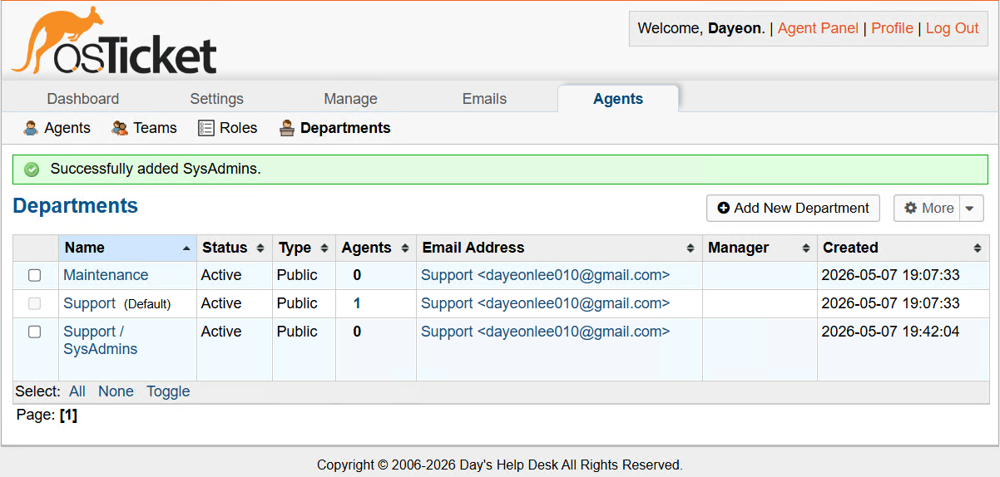
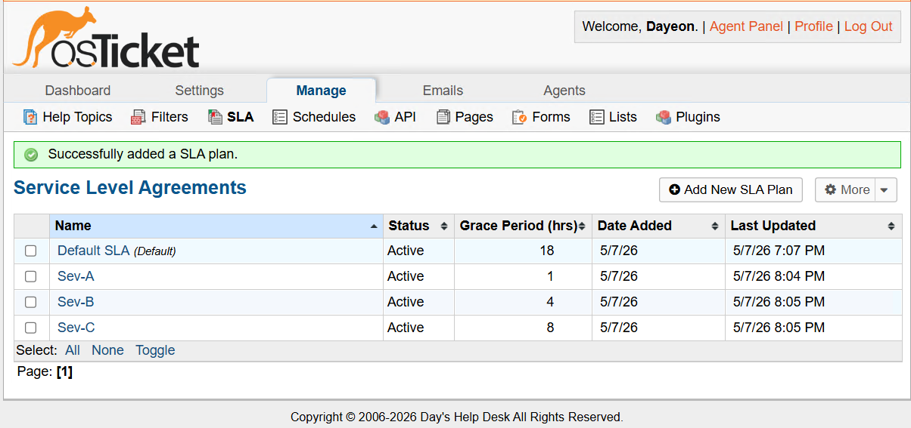
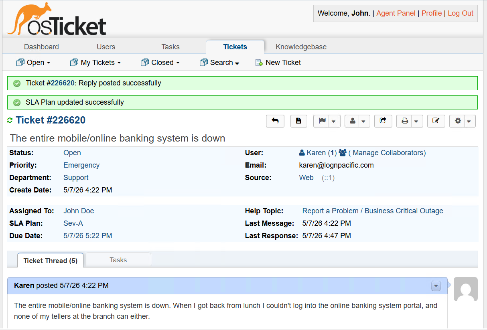
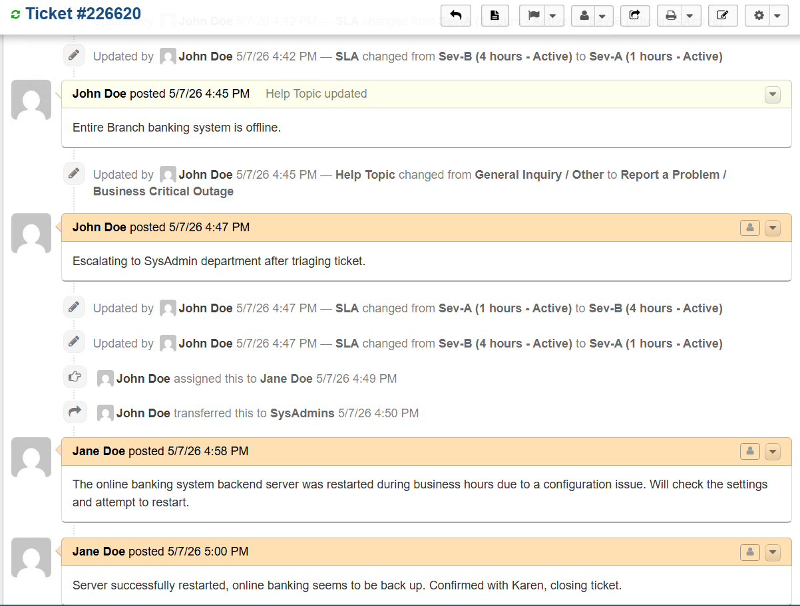
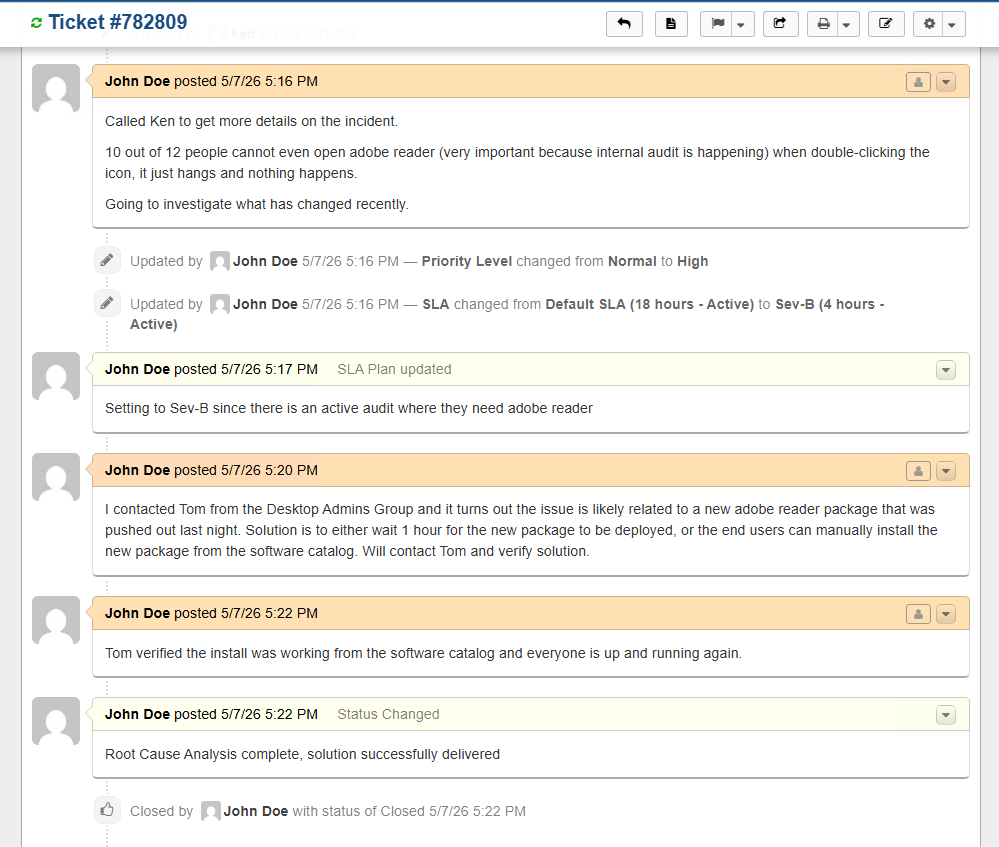

# osTicket Help Desk: Ticketing System Implementation & Lifecycle

## Introduction

This project demonstrates the end-to-end deployment and operational use of **osTicket**, a widely used open-source ticketing platform, within a cloud-hosted environment. The objectives were building a functional **Service Management** hub from the ground up by configuring a web server stack (IIS) and database (MySQL); and simulating a live support environment by managing the complete **Ticket Lifecycle**. This involved creating end-user requests, routing them to the appropriate departments, and following the resolution process through to completion—demonstrating a thorough understanding of both support infrastructure and help desk workflows.

---

## Technical Skills & Tools
* **Ticketing System Management:** osTicket v1.15.8 Deployment, Configuration, and Testing.
* **System Administration:** Windows 11 Pro, User Access Control (ACLs), and Service Management.
* **Web Server Stack:** Internet Information Services (IIS), PHP 7.3.8 Integration, and Extension Management.
* **Database Administration:** MySQL 5.5.62 & HeidiSQL (Schema Setup and User Management).
* **Cloud Infrastructure:** Microsoft Azure Virtual Machine Provisioning (4 vCPUs).
* **Service Management (ITSM):** Analyzing ticket routing, priority levels, and resolution pathways.
---
## Part 1: Server Provisioning & Environment Setup
The objective of this phase was to deploy a virtual machine in Azure and configure the underlying "WIMP" (Windows, IIS, MySQL, PHP) stack required for the osTicket platform.

### 1. Azure Virtual Machine Deployment
* **Hardware Provisioning:** Deployed a Windows 11 Pro instance with **4 vCPUs** to ensure optimal performance for simultaneous web and database operations.
* **Resource Management:** Organized all assets within a dedicated Resource Group to maintain a clean administrative boundary for the lab environment.

### 2. Web Server & PHP Integration
* **IIS Configuration:** Enabled Internet Information Services (IIS) with **CGI** support to allow the server to process dynamic PHP applications.
* **PHP Registration:** Integrated **PHP 7.3.8** into the IIS environment, verifying the configuration via **PHP Manager** to ensure the web server could communicate with the application code.

  
   
  <i>Figure 2: Verifying the PHP installation and extension registration within IIS Manager.</i>

### 3. Database Management
* **MySQL Implementation:** Installed and configured **MySQL 5.5.62** as the backend database engine.
* **Schema Creation:** Utilized **HeidiSQL** to create the `osTicket` database, establishing the foundation for data persistence and user record management.

  
   
  <i>Figure 3: Configuring the MySQL database schema to host the help desk application data.</i>

---

## Part 2: Application Installation & Security Configuration
This phase involved the deployment of the osTicket source code and the critical configuration of the application environment to ensure security and stability.

### 1. File System & Permission Management
* **Installation Path:** Deployed the osTicket source files to the standard IIS web root (`C:\inetpub\wwwroot`).
* **Configuration Security:** Renamed the sample configuration file to `ost-config.php`. To facilitate the installation, I temporarily modified **NTFS permissions** by disabling inheritance and granting "Everyone" Full Control, later reverting these to "Read-Only" to secure the database credentials once setup was complete.

### 2. Resolving Application Dependencies
* **PHP Extension Management:** Identified missing dependencies during the initial web-based setup. Used IIS PHP Manager to manually enable `php_imap.dll`, `php_intl.dll`, and `php_opcache.dll`, ensuring the platform could handle email fetching and internationalization.

### 3. Finalizing Implementation
* **Web-Based Installation:** Completed the osTicket setup wizard by linking the MySQL database and defining the administrative account.
* **Post-Install Hygiene:** Removed the `/setup` directory from the server to prevent unauthorized reconfiguration, a standard security best practice.

  
   
  <i>Figure 4: The successful completion of the osTicket installation, confirming a functional link between the web server and the database.</i>

---

## Part 3: Help Desk Configuration & Organizational Logic
With the infrastructure stable, the focus shifted to configuring the business logic of the help desk. This phase involved setting up the organizational hierarchy and support workflows required for a professional IT environment.

### 1. Departmental Hierarchy & Routing
* **Organizational Structure:** Created distinct departments such as **Support**, **Maintenance**, and **Support/SysAdmins**. This ensures that incoming tickets are automatically funneled to the specialized teams responsible for those specific assets.
* **Help Topics:** Established a menu of specific "Help Topics" (e.g., Password Reset, Equipment Malfunction) to streamline the intake process and ensure the system captures the correct data at the point of submission.

  
   
  <i>Figure 5: Configuring the departmental structure and routing rules within the Admin Panel.</i>

### 2. Service Level Agreements (SLAs) & User Management
* **SLA Policies:** Defined Service Level Agreements (SLAs) to set expectations for response and resolution times. This included setting "Grace Periods" to ensure accountability and track system performance.
* **Role-Based Access:** Configured profiles for **Agents** (technicians) and **Users** (customers), simulating a multi-user corporate environment where permissions and visibility are restricted based on roles.

  
   
  <i>Figure 6: Implementing SLA policies to define priority levels and resolution deadlines.</i>

---
## Part 4: Ticket Lifecycle & Operational Workflow
This phase demonstrates the practical application of the osTicket platform. A live environment was simulated to manage the complete lifecycle of support requests, encompassing initial intake, triage, and final resolution.

### 1. Ticket Intake & Manual Priority Assessment
* **Incident Creation:** Multiple support requests were generated using various Help Topics to validate the system’s intake capabilities and routing logic.
* **Triage & Classification:** Incidents were manually evaluated based on business impact (e.g., "Entire Department Offline"). Priority levels were re-assigned to the appropriate **Severity** tiers and **SLA Plans** to ensure alignment with corporate response standards.

  
   
  <i>Figure 7: Manual triage process to assign appropriate priority levels and SLA plans.</i>

### 2. Resolution & Audit Trail Management
* **Lifecycle Documentation:** Comprehensive audit trails were maintained for both **Sev-A** and **Sev-B** incidents. This involved manual updates to ticket statuses, the inclusion of internal troubleshooting notes, and documented communication with the end-user.
* **Operational Closure:** Formal resolution was achieved by documenting the fix within the ticket thread and transitioning the status to "Resolved," ensuring the support loop was successfully closed.

  
   
  <i>Figure 8: Audit trail for a Severity-A (Critical) incident, detailing agent actions and resolution steps.</i>

  
   
  <i>Figure 9: Audit trail for a Severity-B (High) incident, detailing agent actions and resolution steps</i>

---

## Project Outcome & Key Takeaways
The project successfully established a production-ready IT Service Management (ITSM) environment within Microsoft Azure. By the conclusion of the lab, a fully functional help desk was deployed, featuring a secured "WIMP" stack, automated departmental routing, and a rigorously documented ticket lifecycle.

### Core Technical Competencies
* **Full-Stack Application Deployment:** Practical experience provisioning and managing the interdependencies of the "WIMP" stack (Windows, IIS, MySQL, PHP) to host enterprise-grade web applications.
* **ITSM Workflow Architecture:** Expertise in translating organizational requirements into functional help desk logic, including the configuration of Service Level Agreements (SLAs), Departmental hierarchies, and Help Topic categorization.
* **Access Control & Security Governance:** Implementation of the "Principle of Least Privilege" through the management of NTFS file system permissions and the enforcement of Role-Based Access Control (RBAC) for various user tiers.
* **Incident Lifecycle Management:** Development of a "Support Lead" mindset by manually triaging, prioritizing, and documenting the end-to-end lifecycle of critical (Sev-A) and high-priority (Sev-B) incidents.

### Key Takeaways
* **Infrastructure Interdependence:** Gained a deep understanding of how web servers (IIS), databases (MySQL), and application code (PHP) must be precisely synchronized to provide a stable service environment.
* **Operational Triage:** Developed the ability to evaluate business impact and urgency, moving beyond technical resolution to strategic ticket prioritization.
* **Documentation as a Standard:** Recognized the critical importance of a clear audit trail; every internal note and status change serves as a vital record for both team collaboration and future troubleshooting.
* **Security Discipline:** Practiced essential post-installation hygiene, such as removing setup directories and tightening file permissions, to protect administrative credentials and system integrity.
