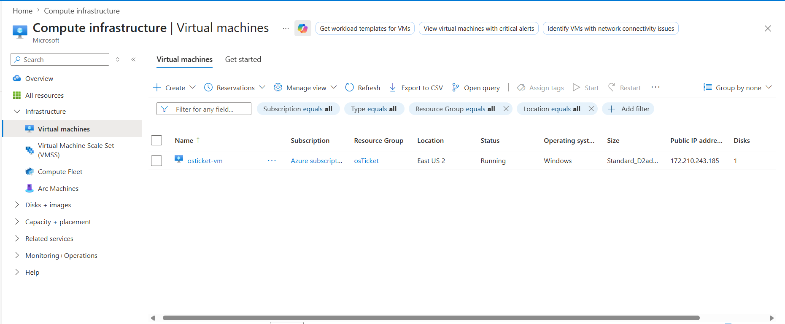
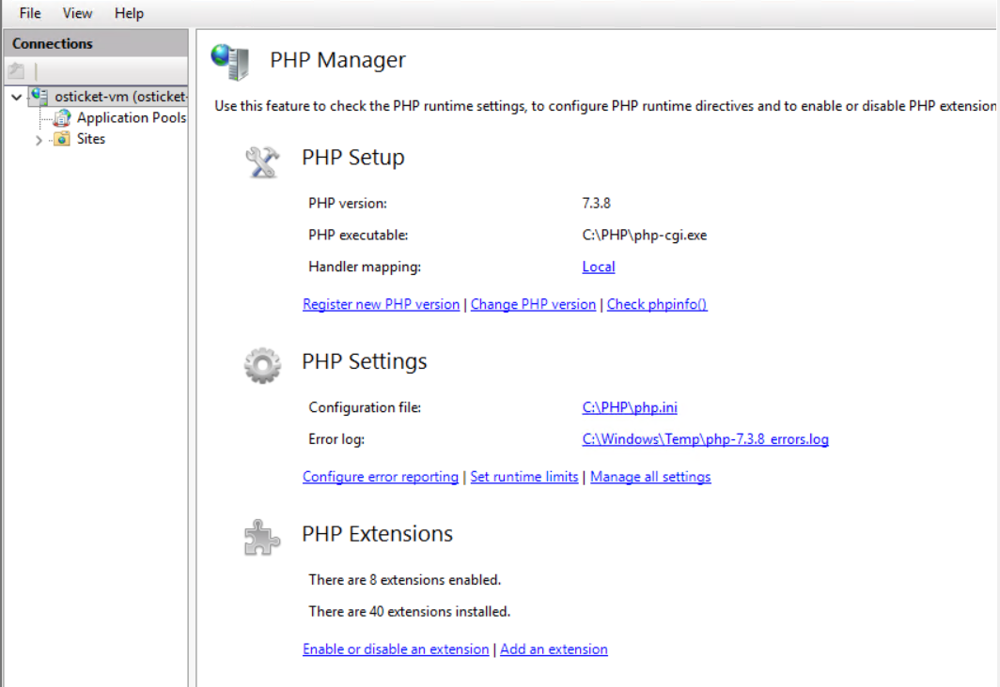
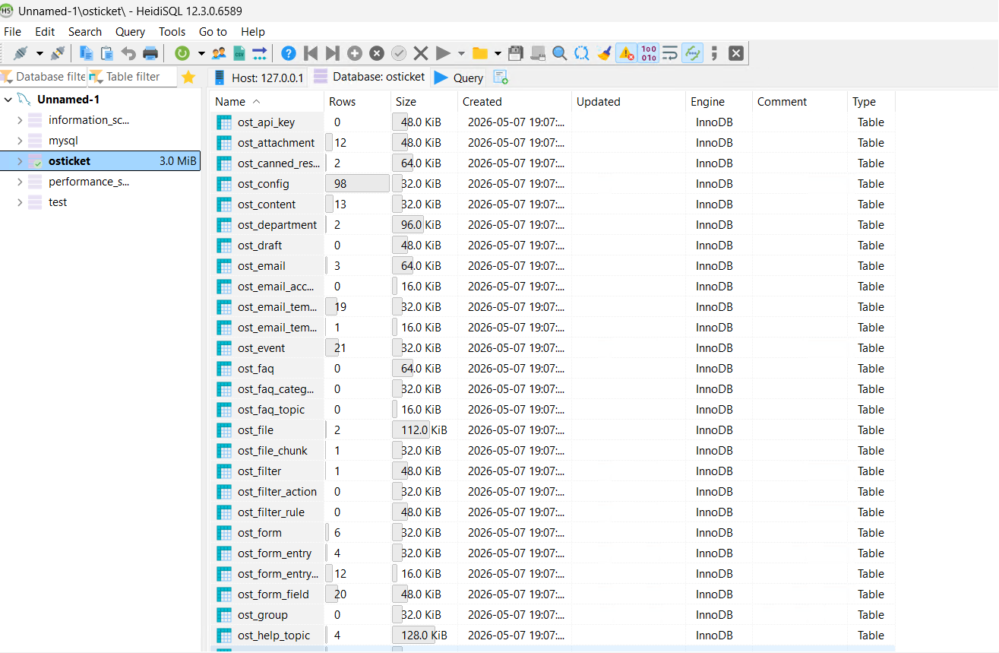
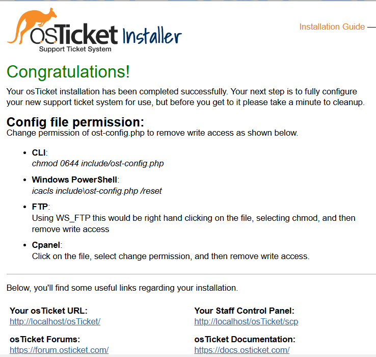

# osTicket Help Desk: Ticketing System Implementation & Lifecycle (Azure)

## Introduction

This project demonstrates the end-to-end deployment and operational use of **osTicket**, a widely used open-source ticketing platform, within a cloud-hosted environment. The objectives were building a functional **Service Management** hub from the ground up by configuring a web server stack (IIS) and database (MySQL); and simulating a live support environment by managing the complete **Ticket Lifecycle**. This involved creating end-user requests, routing them to the appropriate departments, and following the resolution process through to completion—demonstrating a thorough understanding of both support infrastructure and help desk workflows.

---

## Technical Skills & Tools
* **Ticketing System Management:** osTicket v1.15.8 Deployment, Configuration, and Testing.
* **System Administration:** Windows 11 Pro, User Access Control (ACLs), and Service Management.
* **Web Server Stack:** Internet Information Services (IIS), PHP 7.3.8 Integration, and Extension Management.
* **Database Administration:** MySQL 5.5.62 & HeidiSQL (Schema Setup and User Management).
* **Cloud Infrastructure:** Microsoft Azure Virtual Machine Provisioning (4 vCPUs).
* **Service Management (ITSM):** Analyzing ticket routing, priority levels, and resolution pathways.
---
## Part 1: Server Provisioning & Environment Setup
The objective of this phase was to deploy a virtual machine in Azure and configure the underlying "WIMP" (Windows, IIS, MySQL, PHP) stack required for the osTicket platform.

### 1. Azure Virtual Machine Deployment
* **Hardware Provisioning:** Deployed a Windows 11 Pro instance with **4 vCPUs** to ensure optimal performance for simultaneous web and database operations.
* **Resource Management:** Organized all assets within a dedicated Resource Group to maintain a clean administrative boundary for the lab environment.

  
   
  <i>Figure 1: Establishing the Windows 11 Pro instance within the Azure Portal.</i>

### 2. Web Server & PHP Integration
* **IIS Configuration:** Enabled Internet Information Services (IIS) with **CGI** support to allow the server to process dynamic PHP applications.
* **PHP Registration:** Integrated **PHP 7.3.8** into the IIS environment, verifying the configuration via **PHP Manager** to ensure the web server could communicate with the application code.

  
   
  <i>Figure 2: Verifying the PHP installation and extension registration within IIS Manager.</i>

### 3. Database Management
* **MySQL Implementation:** Installed and configured **MySQL 5.5.62** as the backend database engine.
* **Schema Creation:** Utilized **HeidiSQL** to create the `osTicket` database, establishing the foundation for data persistence and user record management.

  
   
  <i>Figure 3: Configuring the MySQL database schema to host the help desk application data.</i>

---

## Part 2: Application Installation & Security Configuration
This phase involved the deployment of the osTicket source code and the critical configuration of the application environment to ensure security and stability.

### 1. File System & Permission Management
* **Installation Path:** Deployed the osTicket source files to the standard IIS web root (`C:\inetpub\wwwroot`).
* **Configuration Security:** Renamed the sample configuration file to `ost-config.php`. To facilitate the installation, I temporarily modified **NTFS permissions** by disabling inheritance and granting "Everyone" Full Control, later reverting these to "Read-Only" to secure the database credentials once setup was complete.

### 2. Resolving Application Dependencies
* **PHP Extension Management:** Identified missing dependencies during the initial web-based setup. Used IIS PHP Manager to manually enable `php_imap.dll`, `php_intl.dll`, and `php_opcache.dll`, ensuring the platform could handle email fetching and internationalization.

### 3. Finalizing Implementation
* **Web-Based Installation:** Completed the osTicket setup wizard by linking the MySQL database and defining the administrative account.
* **Post-Install Hygiene:** Removed the `/setup` directory from the server to prevent unauthorized reconfiguration, a standard security best practice.

  
   
  <i>Figure 4: The successful completion of the osTicket installation, confirming a functional link between the web server and the database.</i>

---
